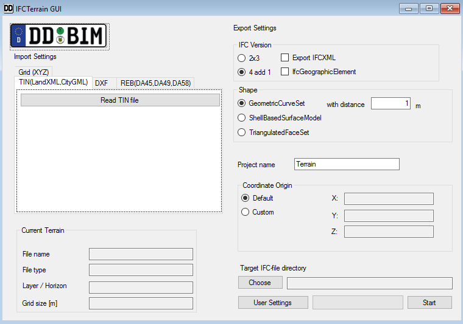
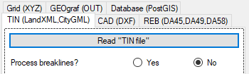
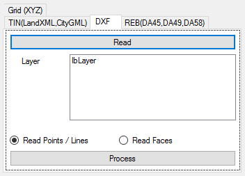
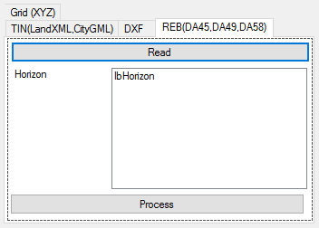
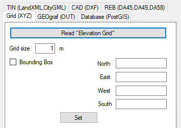
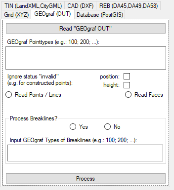
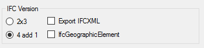
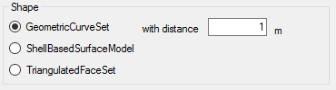
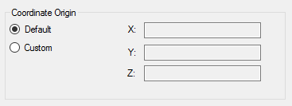

# IFCTerrain Documentation

This document provides description and explains the functionality of the IFCTerrain software tool. The main purpose of IFCTerrain is transforming terrain models of different data formats into IFC (Industry Foundation Classes), which is the common open data exchange format in BIM (Building Information Modeling).


- [IFCTerrain Documentation](#ifcterrain-documentation)
  * [Terrain models in IFC](#terrain-models-in-ifc)
    + [IfcGeometricCurveSet](#ifcgeometriccurveset)
    + [IfcShellBasedSurfaceModel](#ifcshellbasedsurfacemodel)
    + [IfcTriangulatedFaceSet](#ifctriangulatedfaceset)
    + [~~IfcTriangulatedIrregularNetwork~~](#IfcTriangulatedIrregularNetwork)
  * [The IFCTerrain tool](#the-ifcterrain-tool-(GUI))
    + [Import settings](#import-settings)
    + [Export settings](#export-settings)
      - [IFC Version](#ifc-version)
      - [Export shape and model](#export-shape-and-model)
      - [Coordinate Origin](#coordinate-origin)
  * [IFCTerrainCommand](#IFCTerrainCommand)
    + [JSON Attributes](#JSON-Attributes)
    + [FILE-SPECIFIC-Attributes](#FILE-SPECIFIC-Attributes)
  * [Logging](#logging)
  * [Usability of generated IFC files in other software](#usability-of-generated-ifc-files-in-other-software)
    + [Revit](#revit)
    + [Solibri](#solibri)
  * [Testing software for developer](#Testing-software-for-developer)  


## Terrain models in IFC

The IFC data format provides multiple ways to store terrain information. The following subsections contain explanations for these terrain model concepts in IFC, that are supported by IFCTerrain.

### IfcGeometricCurveSet

According to the entity definition, "The IfcGeometricCurveSet is used for the exchange of shape representation of a collection of (2D or 3D) points and curves only".

It contains a list of elements that form the shape representation of the IfcGeometricCurveSet object. Contrary to the IfcGeometricSet from which it inherits the element list, IfcGeometricCurveSet can not have surface objects in its geometric set. It consists stricly of points and curves as stated above.

[IfcGeometricCurveSet - buildingSMART](https://standards.buildingsmart.org/IFC/RELEASE/IFC4/ADD2_TC1/HTML/schema/ifcgeometricmodelresource/lexical/ifcgeometriccurveset.htm)


### IfcShellBasedSurfaceModel

IfcShellBasedSurfaceModel represents a shape by a set of open or closed shells. The singular shells themselves have a dimensionality of 2 and shall not overlap each other. The complete IfcShellBasedSurfaceModel has a dimensionality of 3.

[IfcShellBasedSurfaceModel - buildingSMART](https://standards.buildingsmart.org/IFC/DEV/IFC4_2/FINAL/HTML/schema/ifcgeometricmodelresource/lexical/ifcshellbasedsurfacemodel.htm)


### IfcTriangulatedFaceSet

From the buildingsmart IFC documentation:

>  The IfcTriangulatedFaceSet is a tessellated face set with all faces being bound by triangles. The faces are constructed by implicit polylines defined by three Cartesian points. The coordinates of each point are provided by an index into an ordered list of Cartesian points provided by the two-dimensional list CoordIndex, where

> - the first dimension of the two-dimensional list addresses the list of triangular faces

> - the second dimension of the two-dimensional list provides exactly three indices into the IfcCartesianPointList referenced by Coordinates defined at the supertype IfcTessellatedFaceSet. Each index points to a Cartesian point being a vertex of the triangle.

The type IfcTriangulatedFaceSet is only available in schema IFC4 and not in IFC2x3.

[IfcTriangulatedFaceSet - buildingSMART](http://docs.buildingsmartalliance.org/MVD_SPARKIE/schema/ifcgeometricmodelresource/lexical/ifctriangulatedfaceset.htm)


### IfcTriangulatedIrregularNetwork

Is planned, but not implemented yet.

[IfcTriangulatedIrregularNetwork - buildingSMART](https://standards.buildingsmart.org/IFC/DEV/IFC4_2/FINAL/HTML/schema/ifcgeometricmodelresource/lexical/ifctriangulatedirregularnetwork.htm)


## The IFCTerrain tool (GUI)




### Import settings

The main window of the **IfcTerrain** tool is separated in *import* and *export* *settings*.

In tool is able to import the following data types containing terrain information:

- **LandXML** and **CityGML** containing TIN-Data

  - the user has to choose between LandXML and CityGML after "Read 'TIN file'".
  - If "LandXML" was selected, it is then possible to select whether break lines are to be processed. These must be contained in the <Breaklines> tag. 
  - For CityGML the processing of break lines is currently not possible.

  

- Drawing Interchange File Format (**DXF**) containing points and lines <u>OR</u> faces

	- with DXF the user has to select the layer in which the terrain information is stored and whether the terrain information consists of points and/or lines OR faces and then click process to correctly import the data
	- If broken lines are to be processed, this must be selected with "Yes". Then select the *layer* in which the *break lines* are stored.
	- The settings are to be accepted via the "Process" button.




- **REB data** (formats DA45, DA49 or DA58)
  - similar with DXF, in the REB import the user has to select the horizon in which the terrain data is stored and then click process to correctly import the data




- **Grid**, specifically an elevation grid consisting of points and a regular size of the grid "tiles" (simple .xyz data format)
  - the user has to select the correct grid size <u>used</u> in the file
  - Furthermore, a bounding box can be set by ticking the field, entering the corresponding values (unit: metre) and pressing the "Set" button.



- **GEOgraf** **OUT**, project exchange format 
  - the user can decide which species are to be processed. If these are left blank, all types will be read.
  - the user can decide whether a status (position and height) should be ignored
  - the user can choose whether *areas* or *points & lines* are to be processed
  - the processing of break edges are available (if points & lines have been selected), here a line type containing the break lines is still to be specified
  - the settings are to be accepted via the "Process" button




- **PostGIS**, database connection to query a DTM

  - An account is required that can send a SELECT command for an existing PostGIS database. 
    <u>Note</u>: no data such as passwords are stored! These are only required for establishing a database connection.
  
  - It requires (without break lines): 
  
    - a database, a scheme, 
  
    - the table & column containing the TIN,
  
    - the column with the TIN ID (which is in the same table as the TIN) 
  
    - The following SELECT command is sent to the database:
  
      ```sql
      SELECT ST_AsEWKT(tincolumn) FROM schema.tintable WHERE tinidcolumn = tinid
      ```
  
      
  
  - If break lines are to be processed, it is still necessary:
  
    - a table & column containing the break lines
  
    - For the connection between break line and TIN, a column is to be kept that contains the corresponding TIN ID
  
    - The following SELECT command is sent to the database: 
  
      ```sql
      SELECT ST_AsEWKT(bl_table.bl_column) FROM schema.bl_table JOIN schema.tintable ON (bl_table.bl_tinid = tintable. tinidcolumn) WHERE tintable.tinidcolumn = tinid
      ```
  
      


### Export settings

Under export settings, the user can customize the IFC file that will be generated by the IFCTerrain tool.


#### IFC Version

Within the IFC-Version box, the user can decide:

- between IFC-Versions "2x3" and "4 add 1"

- if IfcGeographicElement entities shall be exported (only available if IFC Version 4 add 1 is selected)

- if a regular IFC file in STEP format or IFCXML in XML format (Export IFC Checkbox checked) shall be generated





#### Export shape and model


Within the "Shape" box, the user can decide between the different possibilities to store the terrain information in IFC (as mentioned above in the chapter "Terrain models in IFC"). Keep in mind that not every BIM software is able to represent these different models in the same way. Which model type should be exported depends on the software that the generated Ifc file shall be imported in.

Additionally the user has the choice to define a minimum distance between points that is allowed in the final mesh of the terrain model. For beginner users this input should be left at its standard value of 1 meter.




#### Coordinate Origin


The coordinate origin box provides the opportunity to customize the coordinate origin of the exported IFC file. Selecting "default" will place the coordinate origin in the middle of the total project area and stored in the IfcSite entity. All of the absolute input coordinates will be transformed in relation to this coordinate origin.

The "custom" option allows the user to define the project coordinate origin to a position of his/her choice.





## IFCTerrain Command

As an alternative to the graphical user interface, it is possible to use the IFCTerrainCommand.exe for generating terrain models in IFC format. For that, a *.json file is required, that contains the information that is required to run the application.

Below are an example for such a json file and a table containing descriptions for every possible attribute. Some sample JSON data sets are stored in the folder: ``IFCTerrainTestData/ 99_JSON``


### JSON Attributes

The json attributes to convert a dtm are listed below. These are divided into: **required** and **file-specific attributes**. 
Hint: Upper and lower case must be observed!

#### **REQUIRED - Attributes**

| attribute | value range | description |
|:-------|:-------|:-------|
|fileName|valid file path string|Path and filename of the input file|
|fileType|LandXML; CityGML; DXF; REB; Grid; OUT [string]|File format of the input file|
|is3D|true; false|Describes whether the generated terrain model should be 3-dimensional or not|
|minDist|double|Sets the minimum distance between nodes in the terrain model|
|destFileName|valid file path string|Path and filename of the output file|
|projectName|string|The project name in the output IFC file|
|editorsFamilyName|string|The editors family name in the output IFC file|
|editorsGivenName|string|The editors given name in the output IFC file|
|editorsOrganisation|string|The editors organization name in the output IFC file|
|outIFCType|IFC2x3; IFC4|Sets the IFC version of the output file|
|outFileType|Step; XML|Sets the file format of the output file|
|surfaceType|GCS; SBSM; TFS|Sets the terrain model type for the output IFC file: GCS=GeometricCurveSet; SBSM=ShellBasesSurfaceModel; TFS=TriangulatedFaceSet|
|geoElement|true; false|Setting, that decides whether the output IFC file should contain an IfcGeographicElement of the terrain or not|
|customOrigin|true; false|Describes whether the project coordinate origin should be set to the user defined position or not. If this is not the case, the following three lines are not necessary!|
|xOrigin|double|The x component of the custom origin|
|yOrigin|double|The y component of the custom origin|
|zOrigin|double|The z component of the custom origin|
|gridSize|integer|The distance between points in the *grid input file*|


#### **FILE-SPECIFIC-Attributes**

The attributes of the respective file format are to be added.

##### Drawing Interchange File Format (DXF)

| attribute | vale range  | description                                                  |
| --------- | ----------- | ------------------------------------------------------------ |
| layer     | string      | Name of the layer that contains terrain information in an input DXF file |
| isTin     | true; false | Describes whether an input DXF file contains tin information (faces) or not |

##### REB (DA45, DA49, DA58)

| attribute | vale range | description                                             |
| --------- | ---------- | ------------------------------------------------------- |
| horizon   | integer    | Number of the horizon that contains terrain information |

##### GRAFBAT (GEOgraf OUT)

| attribute       | vale range  | description                                                  |
| --------------- | ----------- | ------------------------------------------------------------ |
| isTin           | true; false | Decides whether the processing should be done via Points & Lines (=false) or Faces (=true). |
| layer           | string      | Designation of the point types. Separation via: "/" ";" "," permissible |
| onlyHorizon     | true; false | Decides whether all horizons (=false) or only selected ones (=true) are to be used. If filtering is to be used, the entry must be made via "horizonFilter". |
| horizonFilter   | string      | Input only if "onlyHorizon" is true. Designation of specific horizons. Separation via: "/" ";" "," permissible |
| ignPos          | true; false | Decides whether the status code for the location position should be ignored (=true). |
| ignHeight       | true; false | Decides whether the status code for the height position should be ignored (=true). |
| breakline       | true; false | Decides whether break edges are to be processed (true).<br />If this is not the case, the following line is not necessary! |
| breakline_layer | string      | Name of the layer that contains the breakline. (only one layer is allowed) |

##### Database (PostGIS)

| attribute        | value range | description                                                  |
| ---------------- | ----------- | ------------------------------------------------------------ |
| host             | string      | Link to the host database                                    |
| port             | integer     | Specifying the port for the database connection              |
| user             | string      | Specification of the user name for authentication with the database |
| password         | string      | Specification of the password for authentication with the database |
| database         | string      | Target database                                              |
| schema           | string      | Target schema                                                |
| tin_table        | string      | Specify the table that contains the TIN                      |
| tin_column       | string      | Specify the column that contains the *geometry* of the TIN   |
| tinid_column     | sting       | Specify the column that contains the *ID* of the TIN         |
| tin_id           | integer     | Specification of a TIN ID to be read out                     |
| breakline        | true; false | Decides whether break edges are to be processed (true). <br />If this is not the case, the following lines are not necessary! |
| breakline_table  | string      | Specify the table that contains the geometry of the break lines |
| breakline_column | string      | Specify the column that contains the geometry of the break lines |
| breakline_tin_id | string      | Specify the column that contains the TIN ID <br />!Not to be confused with "tin_id". |

Once the input json file is ready one can use the console (cmd) to run the IFCTerrainCommand.exe with the file path of the input json file as a command line argument. For Example:

```powershell
IFCTerrainCommand.exe "D:\Data\input\Sample.json"
```

## Logging

### GUI-Log

The GUI shows the most important work steps. If an error (input or in the program) occurs, it is also recorded here.

### Log-file

A log file is written for each export. This is always located at the storage location of the IFC file. If a conversion does not work as intended, the necessary information is saved here.

## Usability of generated IFC files in other software

Keep in mind that IFCTerrain generates IFC files according to the specified standards of buildingSMART. Unfortunately not every software that works with IFC files is able to interpret these files completely. The following part contains information on how some available software can interpret IFCTerrain-generated IFC files.

### Revit

If you want to use the terrain data with correct coordinates it is important to place the "project base point" at the desired location (same as coordinate origin of IFCTerrain file) before importing the generated IfcTerrain file in Revit.

Furthermore Revit is currently <u>unable</u> to display *IfcTriangulatedFaceSet* entities.

### Solibri

Solibri generally imports almost all IFC information correctly, but is currently <u>unable</u> to display *IfcGeometricCurveSet* entities.


## Testing software for developer

The windows-batch program is a executive testing software. It reads from the ``IFCTerrainTestData``the config data (``IFCTerrainTestData/ 99_JSON``) and is exporting the results of the test data to the export folder (``IFCTerrainTestData/ 00_Export``). This folder will be opened automatically. It creates test IFC-data for:

- [x] TIN (LandXML, CityGML)
- [x] CAD (DXF)
- [x] GRID (XYZ)
- [x] REB (DA45, DA49, DA58)
- [x] GEOgraf (OUT)
- [ ] ~~Database (PostGIS)~~ (currently not available) 